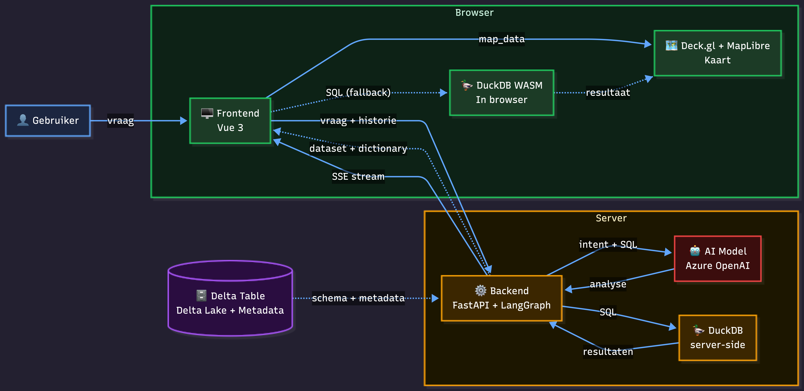
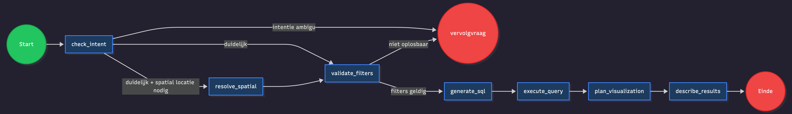

# AI Spatial Assistant

A Dutch-language web application that lets non-technical users ask questions in plain Dutch about spatial datasets (organised in H3 hexagons). The application translates the question into SQL, executes it, and returns the answer as text and as an interactive map. This document is aimed at developers; a more detailed explanation for end-users is in the **About** page in the app ([src/frontend/src/components/info/MeerInfoPage.vue](src/frontend/src/components/info/MeerInfoPage.vue)).

---

## Hackathon quick-start

This repository is the starting point for the hackathon. The spatial assistant is a working chat application that queries geospatial datasets (population, housing, environment, amenities) and visualises the results on an interactive map. You can extend it, swap models, change prompts, or add new datasets.

**Get up and running in three steps:**

1. Clone the repo and enter the directory.
2. Copy the backend environment file and add your OpenAI API key:
   ```bash
   cp src/backend/.env.example src/backend/.env
   # Edit src/backend/.env — set OPENAI_KEY=sk-...
   ```
   The LLM helper, [src/backend/app/services/llm.py](src/backend/app/services/llm.py), uses the standard OpenAI API via `langchain_openai.ChatOpenAI`.
3. Copy the frontend environment file:
   ```bash
   cp src/frontend/.env.example src/frontend/.env
   ```
4. Start the application:
   ```bash
   docker compose up --build
   ```

The app is then available at **http://localhost:5173**. See the [Running with Docker](#running-with-docker) section for more details.

**Data.** The primary datasets are in `src/backend/data/`. If you want to add more data, put it in `src/backend/extra_data/` and register it — but be aware that every extra dataset adds column names to the prompts, which can reduce model accuracy.

---

## Background

Our spatial datasets contain hundreds of columns (population, housing, environment, amenities) and are currently only accessible to people who know SQL or Python. Policy staff and administrators therefore depend on analysts for every insight.

## Goal

A chat interface that lets any user — regardless of technical knowledge — ask questions about this data in plain Dutch, with answers as text and as a map. Answers are streamed, queries are read-only, and the full processing pipeline is visible to the user via the Insight panel.

## Running with Docker

### Requirements

- [uv](https://docs.astral.sh/uv/) (Python package manager):

```bash
curl -LsSf https://astral.sh/uv/install.sh | sh
```

- [Docker](https://docs.docker.com/get-docker/) and [Docker Compose](https://docs.docker.com/compose/install/)
- A `.env` file in `src/backend/` (copy `.env.example` and fill in the values):
- A `.env` file in `src/frontend/` (copy `.env.example` and fill in the values):


```bash
cp src/backend/.env.example src/backend/.env
```
```bash
cp src/frontend/.env.example src/fronted/.env
```

> **LLM configuration.** Before running the app, set `OPENAI_KEY` in `src/backend/.env`. The model is controlled by `OPENAI_MODEL` (default `gpt-5-chat`) — see `.env.example`.

### Git hooks

Install the pre-commit hooks once after cloning:

```bash
uvx pre-commit install
```

### Development

Uses the Vite dev-server with hot-reload for the frontend. Source files are mounted as volumes so changes are immediately visible without a rebuild.

```bash
docker compose up --build
```

| Service  | URL                   |
| -------- | --------------------- |
| Frontend | http://localhost:5173 |
| Backend  | http://localhost:8001 |

The backend is also directly accessible on port 8000. Nginx proxies `/api/` and `/healthcheck` to the backend.

#### Configuration

| Variable  | Default               | Description                            |
| --------- | --------------------- | -------------------------------------- |
| `API_URL` | `http://backend:8000` | Internal backend URL used by nginx     |


### Project structure

```
├── docker-compose.yml              # Development compose
├── docker-compose.prod.yml         # Production compose
├── Makefile
├── docs/                           # Architecture and workflow diagrams
├── tests/
│   └── benchmarks/PRACTIQ/         # Benchmark runner and questions
└── src/
    ├── backend/
    │   ├── .env.example
    │   ├── pyproject.toml
    │   ├── data/               # Primary datasets (Parquet files + LLM metadata)
    │   ├── extra_data/             # Optional extra datasets (see data section)
    │   ├── tests/
    │   └── app/
    │       ├── main.py             # FastAPI app + lifespan
    │       ├── config.py           # Configuration (env vars)
    │       ├── models/             # Pydantic models (state, chat, validation)
    │       ├── routers/            # chat, dataset, dictionary, health endpoints
    │       ├── mlflow_monitoring/  # MLflow tracing setup
    │       └── services/
    │           ├── workflow.py     # LangGraph graph definition
    │           ├── prompts/        # Prompt templates (.md, one per node)
    │           ├── helpers/        # DuckDB, registry, filter validation, spatial
    │           └── nodes/          # One file per LangGraph node
    └── frontend/
        ├── .env.example
        └── src/
            ├── components/         # chat/, map/, inzicht/, info/, layout/
            ├── composables/        # useChat, useMap, useInzicht, …
            ├── services/           # API/SSE client, SQL sanitizer
            └── types/ utils/
```

---

## Testing

All tests can be run from the `src/backend/` directory.

### Unit tests

```bash
uv run pytest tests/unit/
```

### Integration tests

Integration tests run the LangGraph workflow against a live model. They are skipped by default; set `RUN_LIVE_MODEL_TESTS=1` and provide an `OPENAI_KEY` to run them:

```bash
RUN_LIVE_MODEL_TESTS=1 uv run pytest tests/integration/
```

---

## Architecture

The diagram below shows the components and the overall data flow. The internal steps of the backend (the LangGraph nodes) are described in the [Workflow](#workflow-langgraph) section below.



_Mermaid source: [docs/architecture_diagram.mmd](docs/architecture_diagram.mmd) — edit there and re-export via [mermaid.ai](https://mermaid.ai)._

**Initialisation.** On startup the backend reads all Delta tables via the dataset registry, merges the associated metadata files, and builds a data dictionary in memory. The dictionary is served to the frontend via `GET /api/dictionary`.

**SQL execution.** The backend always executes SQL server-side via DuckDB in [src/backend/app/services/nodes/execute_query.py](src/backend/app/services/nodes/execute_query.py), with the `delta` and `h3` extensions loaded. If the query returns rows they are streamed to the frontend via the `map_data` SSE event.

**LLM monitoring.** All LLM calls are traced via MLflow, which tracks prompts, token counts, and latency per LangGraph node. The MLflow UI runs alongside the backend (SQLite-backed, no extra setup required).

**SSE events** ([src/backend/app/routers/chat.py](src/backend/app/routers/chat.py)): `meta`, `text`, `map_config`, `map_data`, `status`, `error`, `done`, `step_thinking_summary`.

## Workflow (LangGraph)

The backend orchestrates each question as a LangGraph state machine. Intent is determined first, then validated against the dataset, and only then is SQL generated and executed. Ambiguous questions or unresolvable filter values result in a clarifying follow-up question rather than a guessed query.



_Mermaid source: [docs/workflow.mmd](docs/workflow.mmd) — edit there and re-export via [mermaid.ai](https://mermaid.ai)._

| Node | What it does |
| --- | --- |
| **check_intent** ([nodes/intent.py](src/backend/app/services/nodes/intent.py)) | Single structured LLM call that analyses intent and fills `relevant_columns`, `filters`, `aggregation`, and optionally `spatial_query`. Routes to a follow-up question if intent is ambiguous. |
| **resolve_spatial** ([nodes/spatial.py](src/backend/app/services/nodes/spatial.py)) | Resolves `PLACE:` origins in `spatial_query.origin_filters` via the PDOK geocoder and converts them to `LATLON:lat,lon` before filter validation and SQL generation. |
| **validate_filters** ([nodes/validate_filters.py](src/backend/app/services/nodes/validate_filters.py)) | Checks categorical filter values against the real dataset, attempts to correct typos/synonyms, and otherwise asks a follow-up question with valid options. |
| **generate_sql** ([nodes/sql_generation.py](src/backend/app/services/nodes/sql_generation.py)) | Generates DuckDB SQL. The prompt includes full metadata only for the relevant columns, plus a compact name list for the rest. |
| **execute_query** ([nodes/execute_query.py](src/backend/app/services/nodes/execute_query.py)) | Executes spatial SQL server-side via DuckDB (`delta` + `h3` extensions) and streams rows via `map_data`. Writes sample + statistics to state for the visualisation and description steps. |
| **plan_visualization** ([nodes/plan_visualization.py](src/backend/app/services/nodes/plan_visualization.py)) | Receives query results (sample + columns) and uses the LLM via structured output (`MapPlan`) to decide which columns to use for colour, height, and icons on the map. |
| **describe_results** ([nodes/describe_results.py](src/backend/app/services/nodes/describe_results.py)) | Streams a Dutch description of the results to the frontend. |

**Two-phase filter validation.** [helpers/filter_validation.py](src/backend/app/services/helpers/filter_validation.py) first validates each filter value individually (in hierarchy: municipality → district → neighbourhood) and then the combination. Mismatches go through fuzzy matching (`difflib.get_close_matches`) and an LLM correction attempt; if that fails, a follow-up question with the available options is returned.

**Spatial queries.** Questions about proximity ("within X km of Y") use an H3 `grid_disk` buffer around all cells of the origin. For specific locations the intent analysis sets a `PLACE:...` origin in `spatial_query`; [nodes/spatial.py](src/backend/app/services/nodes/spatial.py) then resolves that origin via PDOK to `LATLON:lat,lon`. `K` is calculated as `ceil(distance_km / 0.35)` (1 ring ≈ 0.35 km at resolution 9).

## Data

Spatial datasets are stored as **Parquet files** (Snappy-compressed, laid out as `<theme>/<table>/*.parquet`). On startup DuckDB discovers all tables via a glob, joins them via a `LEFT JOIN` on `h3_id`, and builds a data dictionary — see [helpers/tables.py](src/backend/app/services/helpers/tables.py).

| Directory | Contents | Notes |
| --------- | -------- | ----- |
| `src/backend/data/` | Primary datasets | Loaded by default |
| `src/backend/extra_data/` | Optional extra datasets | Can be added to the registry; adding more datasets injects more column names into prompts, which may reduce model accuracy |

Each dataset has its own **metadata file** (`_llm_metadata_*.json`) with column names, descriptions, units, themes, and example values. On startup the metadata files are merged and combined with the schema from the Parquet tables to generate a **data dictionary**.

## Technologies

| Component        | Technology                   | Why                                                                                                                                                                                     |
| ---------------- | ---------------------------- | --------------------------------------------------------------------------------------------------------------------------------------------------------------------------------------- |
| **Frontend**     | Vue 3                        | Lightweight, reactive framework well suited to a single-page chat interface                                                                                                             |
| **Map**          | Deck.gl + MapLibre GL JS     | Deck.gl provides native H3 hexagon rendering with high performance; MapLibre serves as the base map                                                                                     |
| **LLM**          | Configurable (see `.env`)    | Translates natural language to SQL and formulates the answer                                                                                                                            |
| **Backend**      | Python (FastAPI)             | Lightweight API layer for streaming AI responses                                                                                                                                        |
| **Orchestration**| LangGraph                    | Orchestrates the AI workflow as a state machine with nodes, conditional edges, and built-in event streaming                                                                             |
| **Query engine** | DuckDB                       | Executes spatial SQL server-side with the `h3` extension; reads Parquet files directly via `read_parquet()` glob                                                                        |
| **Sessions DB**  | PostgreSQL                   | Stores conversation sessions and query history                                                                                                                                          |
| **Monitoring**   | MLflow                       | Traces all LLM calls — prompts, token counts, and latency per LangGraph node                                                                                                            |
| **Data format**  | Apache Parquet               | Snappy-compressed Parquet files per table, read directly by DuckDB via glob                                                                                                            |

## House style

The application follows the PZH house style via the following component libraries:

- `@pzh-temporary/vue-component-library` (v1.1.12)
- `@pzh-temporary/html-component-library` (v5.0.25)
